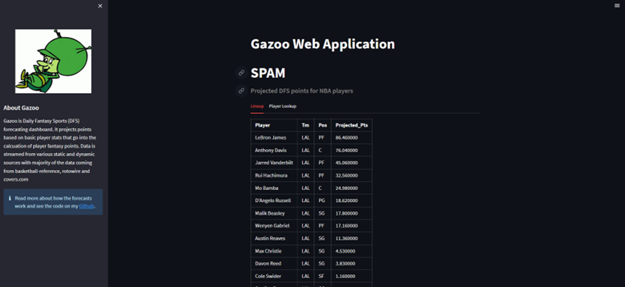
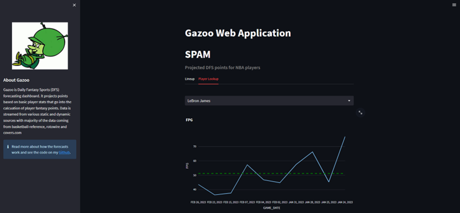

# NBA-DFS-Predictor-Gazoo 

---

## Motivation

This project was inspired by my love for the NBA and Fantasy Sports. This side project started off as a google sheet in 2019 whilst I was completing my Master's degree in uni. This year, I decided to transfer the work on to python by building a streamlit application. This current version is just the beginning and more updates will come along the way! 

*Why the name Gazoo?* The name came from a Flintones character "The Great Gazoo". Funnily enough, whilst creating the original google sheet, I happened to be watching the flintstones and in the episode ["Two Men on a Dinosaur"](https://flintstones.fandom.com/wiki/Two_Men_on_a_Dinosaur), the character Great Gazoo helped Fred and Barney win wagers on dinosaurs by consistently picking winners. At the time, I used to play Daily Fantasy Sports (DFS) on Draftkings and used the spreadsheet to pick winning lineups. My projections were inspired by work from youtuber RickRunGood and helped me win a lot **(>65%)** of my DFS NBA games. So shoutout to [@RickRunGood](https://www.youtube.com/@RickRunGood) and of course, "The Great Gazoo"!  

---

## Overview

### Data Used and Sources

The projections are based of Player per game stats. The characteristics used to predict future fantasy points are as follows:

- Player Per game per Stats
    - Minutes Played (MP)
    - Points (PTS)
    - Assists (AST)
    - Rebounds (TRB)
    - Steals (STL)
    - Turnovers (TOV)
    - 3PTs Made (3PT)

*Above stats were used to caluclate Fantasy Points Per Minute*

- Fantasy Points by Position and Team
- Average covers by Team. 
- Team game logs
    - Matchups
    - Point margins
    
Data was sourced from the following websites:
- [Basketball Reference](https://www.basketball-reference.com/leagues/NBA_2023_per_game.html)
- [Covers.com](https://www.covers.com/)
- [Rotowire](https://www.rotowire.com/basketball/)
- [NBA stats Api](https://github.com/swar/nba_api) 

### Library Used

- Pandas
- Numpy
- NBA stats API
- Plotly
- Streamlit

### Dashboard

The Dashboard consists of two tabs: 

**Tab 1:** Allows the user to select a teams and receive the projected Fantasy Points per Game (FPG) per player in the team. Users can select as many teams as they like. The data is based of 2022-2023 per game stats and is recent. 

[] 

**Tab 2:** Allows the user to check the variability of player's FPG to confirm how they have been performing relative to their average performance in their recent games. This data is based of their last 10 games and data is sourced live from the NBA stats api. An ETL process was created to extract, clean and vidualise the JSON structured data into the streamlit app. 

[]

---

## Project Improvements in Future

- [ ] Livestreaming upcoming matchups and injury lists.
- [ ] Adjusting forecasts using regression techniques to reflect strength of schedule. 
- [ ] Finding alternative method to LookUp function. 
- [ ] Finding a better api to Basketball reference. 

  

